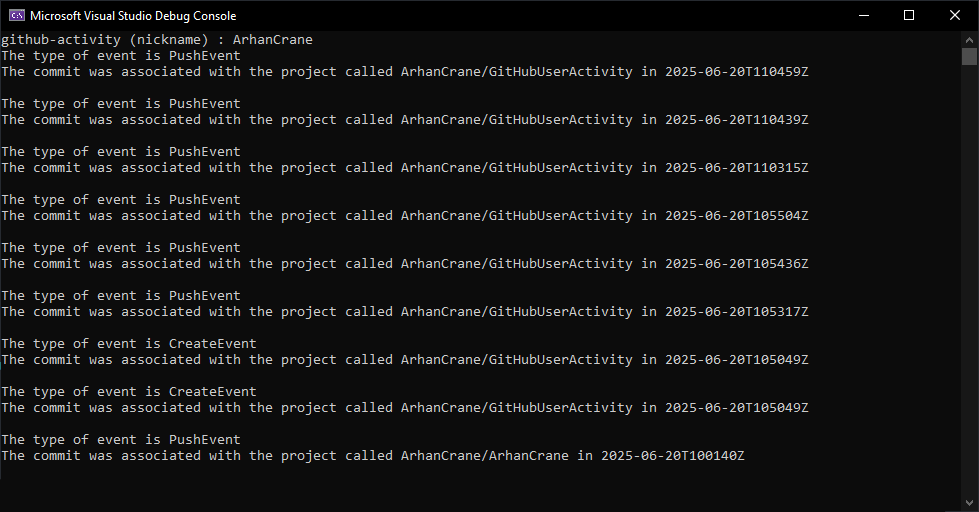

# GitHubUserActivity
A project for making an HTTP request for fetching github user activity from GitHub API. However, it can get only data regarding project commits.

This app uses libcurl library for making http requests.
https://curl.se

Messages the app can print out in console in these cases:
1. There're no commits - "There haven't been any events with this account".
2. There're no account with a given nickname - "The api didn't find this user".
3. If there's some data then you would get the information
   

   
